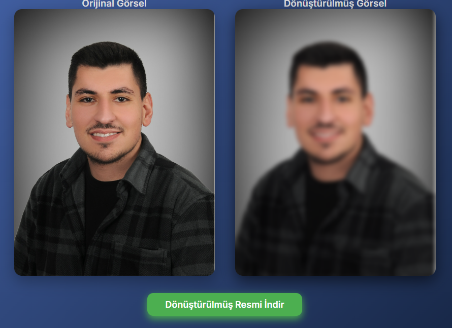

# AI Style Transfer App

## Proje Hakkında
Kullanıcıların fotoğraflarına çeşitli efektler uygulayabildiği modern web uygulaması.

## Klasör Yapısı
ai-style-transfer-app/
│
├── backend/
│ ├── app.py
│ ├── requirements.txt
│ └── ...
│
├── frontend/
│ ├── package.json
│ ├── src/
│ └── ...
│
├── README.md
└── images/ (Ekran görüntüleri için)

## Kurulum ve Çalıştırma

### Backend
- Python 3.13 ve pip kurulu olmalı.
- Paketleri kurmak için terminalde:
pip install -r backend/requirements.txt
- Backend’i başlatmak için:
python backend/app.py

### Frontend
- Node.js yüklü olmalı.
- Terminalde frontend klasörüne geç:
- Paketleri kur:
npm install
- Frontend’i çalıştır:
npm run dev

## Özellikler
- Siyah Beyaz (Grayscale)
- Renk Canlandırma (Color Enhance)
- Bulanıklaştırma (Blur)
- Yansıtma (Mirror Flip)
- Sepia (Eski Fotoğraf Efekti)
- Karikatür Efekti (Cartoon)
- Negatif (Invert Colors)
- Parlaklık Artırma (Brightness Increase)
- Dönüştürdüğünüz tüm resimleri indirebilirsiniz

## Özellikler ve Ekran Görüntüleri

### Siyah Beyaz Efekti

Bu efekt orijinal fotoğrafı siyah beyaz hale getirir.

### Bulanıklaştırma Efekti

Fotoğrafın netliğini azaltarak hoş bir bulanık efekt oluşturur.

### Cartoon (Karikatür) Efekti

Resmi çizgi film havasında, daha eğlenceli bir görünüme dönüştürür.

## Katkıda Bulunmak İster misin?
Pull request’lere açığız!

## Lisans
MIT License
